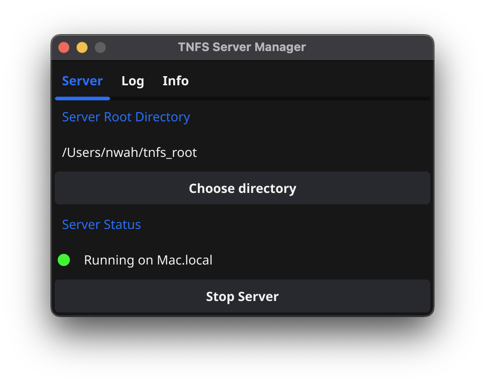

# TNFS Server Manager
A small GUI for managing a local [TNFS server](https://github.com/fujiNetWIFI/tnfsd) for use with [FujiNet](https://fujinet.online).

_Available or Windows, Mac, and Linux*_

## Installation

### Windows
1. Download the latest **TNFS Server Manager (Win).zip** from the Releases page
2. Unzip and place the **TNFS Server Manager** folder wherever you like (e.g. `C:\Program Files`)

### macOS
1. Download the latest **TNFS Server Manager (Mac).zip** from the Releases page
2. Unzip and move **TNFS Server Manager.app** wherever you like (e.g. `/Applications`)

## Usage

### Windows

#### On your PC
1. Double-click **TNFS Server Manager.exe** to launch the program
2. Choose a root directory for the server. This should be a folder containing disk images for your vintage system
3. Click **"Start Server"**

#### On your vintage computer
1. Connect your FujiNet and power up your computer
2. Ensure your FujiNet is on the same WiFi network as your PC
3. In the **Hosts** section, choose a slot and enter your PC's hostname or IP address
4. Select your PC host, and you should see the files in the root directory on your PC
5. Choose a disk image; Choose a virtual disk drive slot; Select Read or Read/Write
6. Mount and boot!

### macOS

#### On your Mac
1. Double-click **TNFS Server Manager.app** to launch the program
2. On first launch, you will have to manually allow the app to run by going to `System Settings > Privacy & Security`, and clicking **"Open anyway"**
3. Choose a root directory for the server. This should be a folder containing disk images for your vintage system
4. Click **"Start Server"**

#### On your vintage computer
1. Connect your FujiNet and power up your computer
2. Ensure your FujiNet is on the same WiFi network as your Mac
3. In the **Hosts** section, choose a slot and enter your Mac's hostname or IP address
4. Select your PC host, and you should see the files in the root directory on your PC
5. Choose a disk image; Choose a virtual disk drive slot; Select Read or Read/Write
6. Mount and boot!
